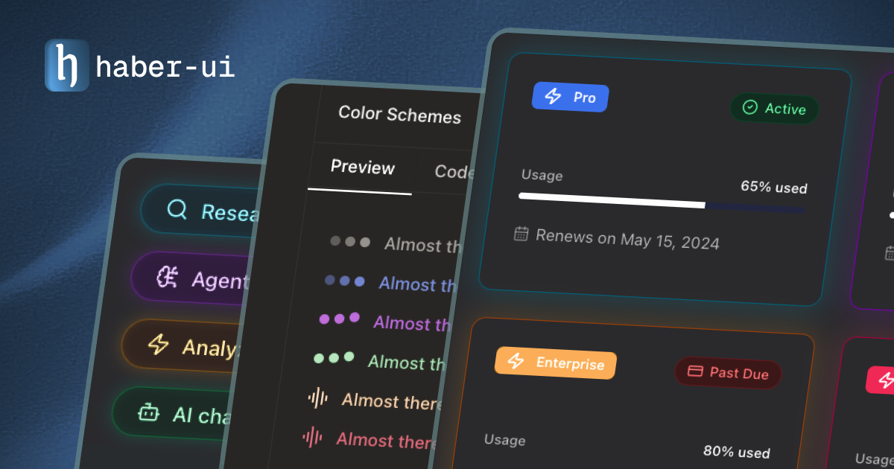

# haber-ui



Modern React components for modern AI applications. Built with Tailwind CSS and shadcn/ui.

Visit the [documentation](https://www.haberui.com/docs/installation) for more information.

## Install

```bash
pnpm dlx shadcn@latest init
pnpm dlx shadcn@latest add "https://haberui.com/h/[component-name].json"
```

## Contributing

See [CONTRIBUTING.md](CONTRIBUTING.md) for details.

## License

MIT License
